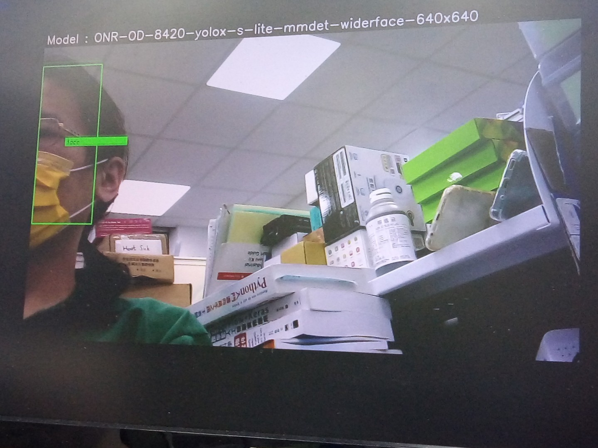

# TI_SK68_edgeai_yaml  
For study/develop TI edge AI wiht am68a/am62a/TDA4VM   
The config file for app_edgeai.py and app_edgeai  
Copy the yaml file to /opt/edgeai-gst-apps/tests/t1/  
 
Then test by command line  
/opt/edgeai-gst-apps/apps_python/app_edgeai.py -n -v /opt/edgeai-gst-apps/tests/t1/ONR-OD-8420.yaml  
or  
/opt/edgeai-gst-apps/apps_cpp/bin/Release/app_edgeai -n -v /opt/edgeai-gst-apps/tests/t1/ONR-OD-8420.yaml  
  
    

These yaml file need  HDMI monitor (1920x1080) and Logi C270 USB camera (1280x720)  

## note 1  
There are 12 type of AI-model in SK68  
root@am68a-sk:/opt/model_zoo/  
ONR-CL-6360-regNetx-200mf                                              
ONR-OD-8020-ssd-lite-mobv2-mmdet-coco-512x512                        
ONR-OD-8200-yolox-nano-lite-mmdet-coco-416x416                       
ONR-OD-8220-yolox-s-lite-mmdet-coco-640x640                          
ONR-OD-8420-yolox-s-lite-mmdet-widerface-640x640                     
ONR-SS-8610-deeplabv3lite-mobv2-ade20k32-512x512                     
TFL-CL-0000-mobileNetV1-mlperf                                       
TFL-OD-2010-ssd-mobV2-coco-mlperf-300x300                            
TFL-SS-2580-deeplabv3_mobv2-ade20k32-mlperf-512x512                  
TVM-CL-3090-mobileNetV2-tv                                           
TVM-OD-5120-ssdLite-mobDet-DSP-coco-320x320                          
TVM-SS-5710-deeplabv3lite-mobv2-cocoseg21-512x512
